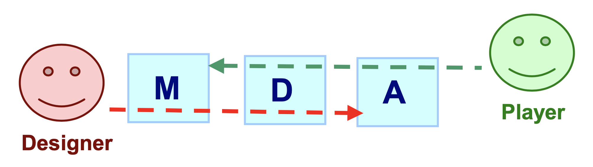
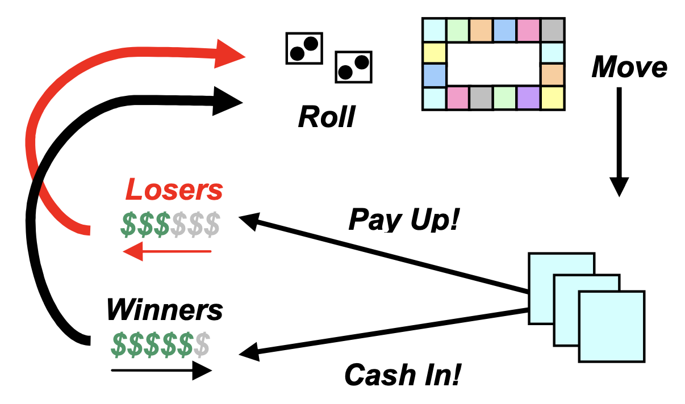

# MDA?

- **Mechanics**: beschreiben die genauen Komponenten eines Spiels, auf Ebene der Datenrepräsentation und Algorithmen
- **Dynamics**: beschreiben das Laufzeitverhalten der Mechanics, das Verhalten von Spielerinputs und ihrer Outputs über die Zeit des Spiel hinaus
- **Aesthetics**: beschreibt die gewünschten emotionalen Reaktionen, die im Spieler geweckt werden sollen wenn er mit dem Spiel interagiert

## Arten von Ästhetik

- **Sensation** (game as sense-pleasure)
- **Fantasy** (game as make-believe)
- **Narrative** (game as drama)
- **Challenge** (game as obstacle course)
- **Fellowship** (game as social framework)
- **Discovery** (game as uncharted territory)
- **Expression** (game as self-discovery)
- **Submission/Abnegation** (game as pastime, to “zone out”)

## Dynamic Models

Dynamics kreieren ästhetische Erfahrungen.
Dazu werden verschiedene Arten von Ästhetiken erreicht, indem Dinge wie Zeitdruck und gegnerisches Spielen (**Challenge**) oder Informationen austauschen und Vorteile durch Kooperation schaffen (**Fellowship**) ermöglicht werden.
Inputs generieren unvorhersehbare Outputs, was in Feedbacksystemen wie hier beispielsweise für Monopoly visualisiert werden kann:

## Mechanics

Mechanics sind die verschiedenen Aktionen, Verhalten und Kontrollmechanismen innerhalb des Spielkontexts.
Zusammen mit dem Spielinhalt (Levels, Objekte usw.) unterstützen die Mechanics Gameplay-Dynamics.
Wenn man Mechanics anpasst, kann man damit die Dynamics über das gesamte Spielerlebnis hinweg "fine-tunen".
Als Beispiele solcher Mechanics und daraus entspringende Dynamics:

- **Kartenspiele**: Mischeln, Trumpf-Spielen und Wetten $\rightarrow$ Bluffen
- **Shooter**: Waffen, Munition, Spawnpunkte $\rightarrow$ Camping, Sniping
- **Golf**: Bälle, Schläger, Sandlöcher, Tsunamis $\rightarrow$ zerbrochene oder versunkene Schläger und Bälle und Eierstöcke

Anpassungen bei Monopoly wären beispielsweise das **Einführen von Bonüsschen** für Spieler, die beschissen spielen und hinterherhinken, und **Einführen von Strafen (physisch und finanziell)** für zu reiche Spieler.
Diese können evtl. bei speziellen Punkten wie dem Start, beim Verlassen des Gefängnis oder anderen Situationen eingeführt werden.
So kann man schlechte Spieler ermuntern, kompetitiv weiter zu spienen und das Spiel für sie länger interessant halten.

Um die Spannung aufrecht zu erhalten, könnte man Zeitdruck aufbauen und den Spielverlauf beschleunigen.
Dies beispielsweise mit dem Verfall des Wertes von Ressourcen, konstant steigende Steuern mit mehr Gebäuden, Auszahlungen verdoppeln und so 'nen Seich.
Wenn man dies dann testet und weiter "fine-tuned", wird Monopoly vielleicht irgendwann ganz gut ausbalanciert.

Link zum Paper für weiterführende Schlauheiten (klick doch einfach drauf): 

[MDA: A Formal Approach to Game Design and Game Research](https://users.cs.northwestern.edu/~hunicke/MDA.pdf)

# Teil I : Die gemeinsame Mechanik

*Für Teil 1 der Analyse muss eine Mechanik identifiziert werden, die zwar in beiden Spielen auftritt aber in unterschiedlicher Ausprägung, so dass sich das Spielerlebnis jeweils unterscheidet. 
Diese Mechanik muss dann beschrieben werden, ebenso wie die darauf resultierende Dynamik bzw. Ästhetik; jeweils mit einem Fokus auf die Unterschiede.*

## Gewählte Mechanik

# Teil II : Die gemeinsame Ästhetik

*Teil 2 der Analyse beginnt bei einer Ästhetik, die in beiden Spielen vorhanden ist, aber ebenfalls unterschiedlich ausgeprägt. 
Hier müssen nun die Dynamiken identifiziert werden, die diese Ästhetik hervorrufen und die zugrundeliegenden Mechaniken (erneut jeweils mit Betonung der Unterschiede zwischen den beiden Spielen).*

## Gewählte Ästhetik

