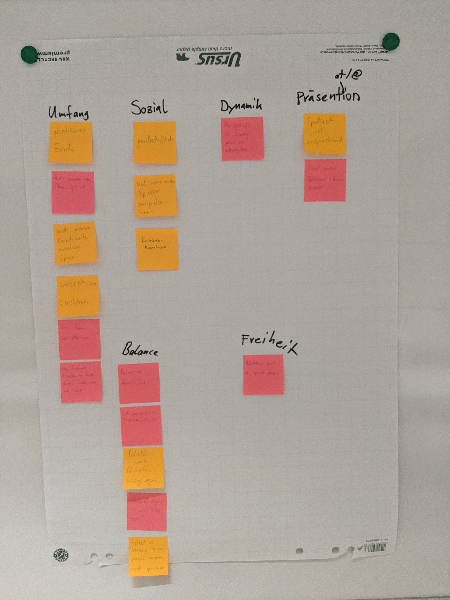

# Aufgabe 1: Vier Arten von FUN!

## Hard Fun (Frustration / Fiero, Stolz)

### Dark Souls 3

Auch wenn People Fun wichtig ist, für mich ist Hard Fun am wichtigsten.
Beispiel Dark Souls 3: Der Spieler muss sich von Beginn des Spiel an verschiedensten Herausforderungen stellen (schwere Gegner, tückische Umgebung, horrende Bosskämpfe) und ihm wird kein Erfolgserlebnis geschenkt. Nur mit Übung und Strategie kann er bereits die anfänglichen Gegner meistern, wird dabei aber stets von Frustration und Wut begleitet, da Sterben an der Tagesordnung ist. Bei jedem Tod verliert der Spieler auch seine gesamte «Währung» und muss sich alles wieder erarbeiten (ausser er schafft es, seine «Währung» an seinem Todesort wieder einzusammeln). Desto grösser ist dann die Freude bzw. der Stolz (Fiero), wenn der Spieler einen Abschnitt (fast) problemlos meistert oder sogar einen Boss bezwingt und dafür entsprechend belohnt wird. Der Weg dahin ist hart, benötigt viel Strategie und Übung, doch umso grösser ist die Freude, wenn er dies schlussendlich geschafft hat.

\pagebreak

# Aufgabe 2: Aes(s)thetics in Games

\pagebreak

## Aesthetics der Gruppe 4 
### (Brändi Dog / Rollercoaster Tycoon)

(*Kursiv* werden alle Post-Its des hundsverlocheten Brändi Dog markiert. Es lebe der Rollercoaster Tycoon Wahn!)

- **Sensation (game as sense-pleasure)**
    - *Auch mehrere Durchläufe machen Spass*
    - *Spielbrett ist ansprechend*
    - Liebevoll gestaltete Spielewelt (Kotze, Sadismus und dergleichen)
- **Fantasy (game as make-believe)**
    - Freies Bauen von Attraktionen
- **Narrative (game as drama)**
    - *** An diesen Spielen ist nichts narratives! ***
- **Challenge (game as obstacle course)**
    - Die Spielwelt ist "lebendig", verhält sich unterschiedlich
    - Balance von Gefahr / Sicherheit
    - Taktisches Vorgehen ist wichtig (Geld ausgeben oder Sachen rechtzeitig abbrennen)
- **Fellowship (game as social framework)**
    - *Gesellschaftlich*
    - *Weil man andere Spieler ausspielen kann*
    - *Kooperation / Koordination*
    - *Taktik und Glück ausgewogen*
    - *Selbst im Verzug kann man immer noch gewinnen*
- **Discovery (game as uncharted territory)**
    - Trotz Grenzen eine offene Spielwelt
    - Unterhaltung jenseits der Spielewelt möglich
- **Expression (game as self-discovery)**
    - Die kaufbaren Erweiterungen hatten damals wirklich noch viel Inhalt
    - Ich kann persönliche Präferenzen einbringen
- **Submission/Abnegation  (game as pastime, to “zone out”)**
    - *Absehbares Ende*

Um ehrlich zu sein: Wahrscheinlich passen die meisten Post-It's in keine der zugeordneten Kategorien. Unsere Post-It's waren auch einfach Müll.

\pagebreak

# Aufgabe 3: All diese Arten von Spass

## Hotline Miami

- **Clearing**: Das Ziel jedes Levels ist das «Clearing» jedes Levels – bedeutet, es von jeglichen Gegnern zu befreien und alle Collectibles im Level zu finden und aufzusammeln.
- **Goal-Completion**: Dem Spieler wird zwar ein (fast immer) offenes Level dargelegt, ihm ist jedoch klar, dass er dieses «aufräumen» und alle Gegner besiegen muss. Hat er dies erreicht, wird ihm dies akustisch mitgeteilt und er kann das Level daraufhin auch wieder verlassen.
- **Obstacle**: Jedes Level bringt eine einzigartige Challenge mit sich, welche der Spieler auf viele verschiedene Arten angehen kann und dieses schlussendlich überkommen muss.
- **Sensation**: Einfach nur der nackte Wahnsinn. Wortwörtlich. In einem dunklen Raum mit Kopfhörern bietet sich dem Spieler ein einziger Psychotrip der Extraklasse ab – dies akustisch durch feinste Musikuntermalung und knalliger 2D-Pixel-Grafik. Und von den blutig süssen Animationen fangen wir gar nicht erst an.
- **Victory**: Ist der letzte Gegner besiegt und die Musik schwingt in’s Gemütliche über, man weiss man erhält eine neue Maske mit besonderen Fähigkeiten am Ende von fast jedem Level – man ist dem Ziel und dem Sieg über das Spiel immer näher.
